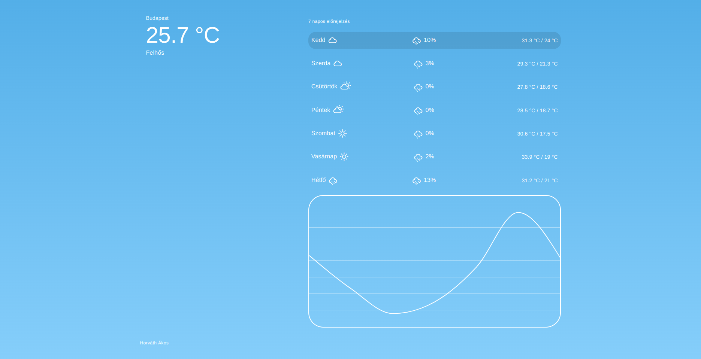
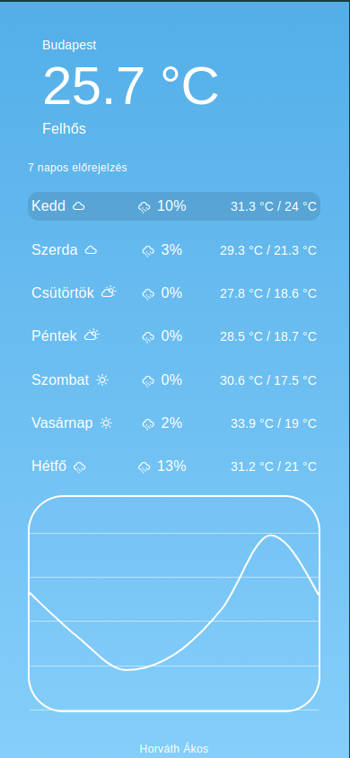

# Medicover Homework

This repositroy contains my solution for the Frontend Developer position homework.

## About the project

A reactive Frontend interface of a meterology application for mobil and desktop.

Searching for a city will display multiple (max 10) results if available for the search term.

Selecting the city will save the city to the browsers local storage.

Related weather and a 7 day forcast for the saved or selected city will be displayed.

### Desktop

### Mobile

## Stack used

- React
- Typescript
- [TanStack Query](https://tanstack.com/)
- [Material UI](https://mui.com/)

## How to start

Install required packages with `npm install`

Start locally with `npm start`
